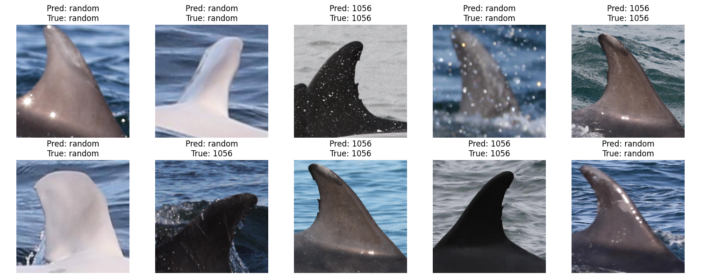

### Description
ML instrument for the Photo-ID recognition.
Fins of bottlenose dolphins are unique and recognisable.
For the mark-recapture models the base of photos of fins is used.

Kaggle topic: [Kaggle](https://www.kaggle.com/competitions/happy-whale-and-dolphin)

Base: [Dataset](https://www.abdn.ac.uk/sbs/outreach/lighthouse/gallery/album13/?fbclid=IwY2xjawGQcuRleHRuA2FlbQIxMAABHdPfK2PrE_uKVjk_Y1kN1G_FLOycrCdkWerwp2LU2te4qgmQkFSlAVi_mQ_aem_MgYiYN-PsHb4zaPRKKmDng)

Idea: [Reference](https://onlinelibrary.wiley.com/doi/epdf/10.1111/mms.12849)

### Results 
Results on 10 randomly-picked fin's images:

